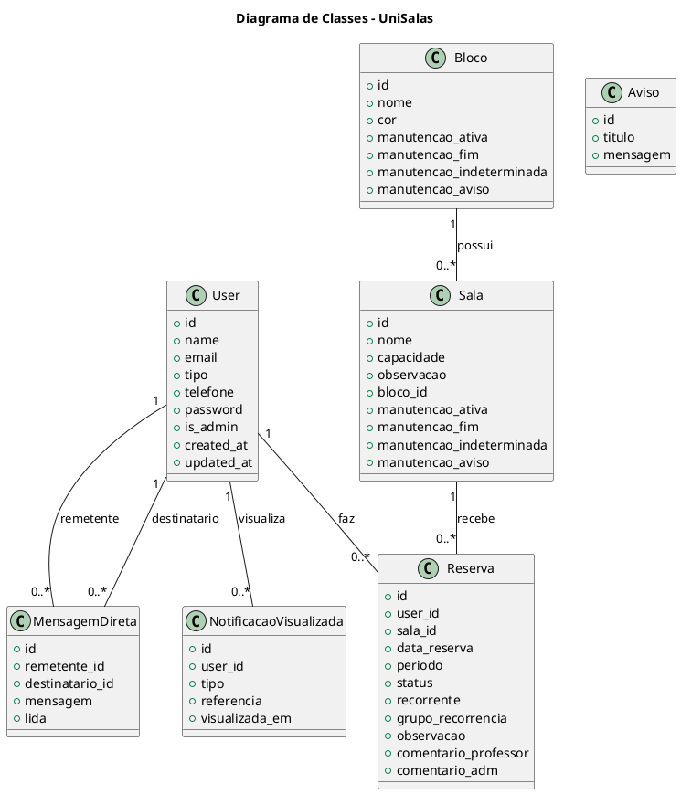
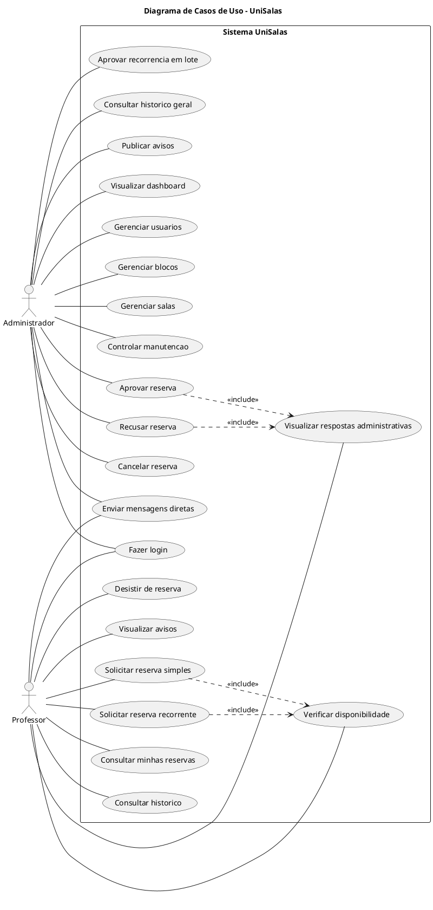

# Documentacao completa do projeto UniSalas

## 1. Identificacao do projeto

**Nome do sistema:** UniSalas  
**Tipo:** Sistema web de reserva e gerenciamento de salas academicas  
**Framework principal:** Laravel 12  
**Linguagem principal:** PHP 8.2+  
**Banco de dados:** MySQL ou MariaDB  
**Interface:** Blade, Bootstrap 5, Font Awesome e SweetAlert2  
**Ambiente usado no desenvolvimento:** Windows com XAMPP  
**Repositorio local:** `c:\xampp\htdocs\reserva-salas`

O UniSalas e uma aplicacao web criada para centralizar o processo de solicitacao, aprovacao e acompanhamento de reservas de salas academicas. O sistema possui dois perfis principais: administrador e professor.

## 2. Objetivo do sistema

O objetivo do UniSalas e substituir controles manuais e dispersos por um fluxo digital centralizado. O sistema permite que professores solicitem reservas de salas, acompanhem respostas administrativas, consultem historico e troquem mensagens com a administracao. O administrador gerencia usuarios, blocos, salas, manutencoes, reservas, avisos, mensagens e historico.

## 3. Escopo funcional

### 3.1 Funcionalidades do administrador

- Fazer login com perfil administrativo.
- Visualizar dashboard com totais de usuarios, blocos, salas, reservas pendentes e reservas aprovadas.
- Cadastrar, editar e excluir usuarios.
- Cadastrar, editar e excluir blocos.
- Cadastrar, editar e excluir salas vinculadas a blocos.
- Definir cor visual para blocos.
- Colocar bloco em manutencao.
- Colocar sala em manutencao.
- Definir manutencao por prazo determinado ou indeterminado.
- Cancelar automaticamente reservas futuras afetadas por manutencao.
- Visualizar reservas pendentes e em analise.
- Aprovar ou recusar reservas individualmente.
- Aprovar ou recusar reservas recorrentes em lote.
- Cancelar reserva com justificativa.
- Consultar historico geral de reservas.
- Filtrar historico por data, bloco, sala e periodo.
- Publicar avisos.
- Excluir avisos.
- Enviar mensagens diretas para professores.
- Visualizar mensagens nao lidas.
- Apagar conversas.

### 3.2 Funcionalidades do professor

- Fazer login com perfil de professor.
- Visualizar painel com resumo das reservas.
- Visualizar avisos publicados pela administracao.
- Solicitar reserva simples.
- Solicitar reserva recorrente.
- Verificar disponibilidade de sala.
- Consultar minhas reservas.
- Visualizar status das reservas.
- Visualizar comentarios administrativos.
- Consultar historico proprio.
- Desistir de uma reserva.
- Enviar mensagens diretas para administradores.
- Visualizar mensagens nao lidas.
- Apagar conversas.

### 3.3 Funcionalidades publicas e de apoio

- Redirecionamento da rota raiz para a tela de login.
- Tela de login com protecao de cache.
- Logout com invalidacao da sessao.
- Rotas locais de demonstracao para facilitar testes em ambiente de desenvolvimento.

## 4. Tecnologias utilizadas

| Camada | Tecnologia | Uso |
|---|---|---|
| Back-end | PHP 8.2+ | Linguagem principal da aplicacao |
| Framework | Laravel 12 | Rotas, controllers, models, migrations, autenticacao e sessoes |
| Banco de dados | MySQL/MariaDB | Persistencia dos dados |
| ORM | Eloquent | Models e relacionamentos |
| Front-end | Blade | Templates renderizados pelo Laravel |
| Interface | Bootstrap 5 | Layout, grid, botoes, formularios e componentes |
| Icones | Font Awesome | Iconografia da interface |
| Alertas | SweetAlert2 | Feedback visual para o usuario |
| Build front-end | Vite | Ambiente de desenvolvimento e build |
| CSS utilitario | Tailwind CSS | Dependencia disponivel no projeto |
| HTTP JS | Axios | Dependencia disponivel para requisicoes |
| Testes | PHPUnit 11 | Testes automatizados do Laravel |
| Gerenciador PHP | Composer | Dependencias PHP |
| Gerenciador JS | NPM | Dependencias front-end |

## 5. Requisitos de ambiente

### 5.1 Requisitos minimos

- PHP 8.2 ou superior.
- Composer instalado.
- Node.js e NPM instalados.
- MySQL ou MariaDB.
- Apache, Nginx ou servidor embutido do Laravel.
- Extensoes PHP comuns do Laravel habilitadas, como `pdo_mysql`, `mbstring`, `openssl`, `tokenizer`, `xml`, `ctype`, `json` e `fileinfo`.

### 5.2 Ambiente recomendado para XAMPP

Colocar o projeto em:

```text
C:\xampp\htdocs\reserva-salas
```

Iniciar no XAMPP:

- Apache
- MySQL

## 6. Instalacao e execucao

### 6.1 Instalar dependencias

```bash
composer install
npm install
```

### 6.2 Criar arquivo `.env`

No Windows:

```bash
copy .env.example .env
```

No Linux/macOS:

```bash
cp .env.example .env
```

### 6.3 Gerar chave da aplicacao

```bash
php artisan key:generate
```

### 6.4 Configurar banco no `.env`

```env
DB_CONNECTION=mysql
DB_HOST=127.0.0.1
DB_PORT=3306
DB_DATABASE=reserva_salas
DB_USERNAME=root
DB_PASSWORD=
```

Se o MySQL possuir senha, preencher `DB_PASSWORD`.

### 6.5 Criar banco e tabelas usando Laravel

Criar o banco vazio no phpMyAdmin com o nome:

```text
reserva_salas
```

Depois executar:

```bash
php artisan migrate --seed
```

### 6.6 Criar banco usando script SQL

Tambem foi criado um script consolidado:

```text
docs/database_unisalas.sql
```

Para executar no MySQL:

```bash
mysql -u root -p < docs/database_unisalas.sql
```

Se o usuario `root` nao tiver senha, pode usar:

```bash
mysql -u root < docs/database_unisalas.sql
```

### 6.7 Rodar aplicacao

Terminal 1:

```bash
php artisan serve
```

Terminal 2:

```bash
npm run dev
```

Acessar:

```text
http://127.0.0.1:8000
```

## 7. Usuarios de teste

### 7.1 Administrador

```text
E-mail: l@gmail.com
Senha: 12345678
```

### 7.2 Professor

```text
E-mail: professor@unisalas.local
Senha: 12345678
```

## 8. Estrutura de diretorios

```text
app/
  Http/
    Controllers/
      AdminController.php
      AuthController.php
    Middleware/
      CheckAdmin.php
  Models/
    Aviso.php
    Bloco.php
    MensagemDireta.php
    NotificacaoVisualizada.php
    Reserva.php
    Sala.php
    User.php

database/
  migrations/
  seeders/

resources/
  views/
    admin/
    auth/
    layouts/
    mensagens/
    professor/
    public/

routes/
  web.php

public/
  vendor/
    bootstrap/
    fontawesome/
    sweetalert2/

docs/
  DOCUMENTACAO_COMPLETA_UNISALAS.md
  database_unisalas.sql
```

## 9. Arquitetura da aplicacao

O sistema segue a arquitetura MVC do Laravel:

- **Model:** representa entidades e relacionamentos do banco.
- **View:** telas Blade exibidas ao usuario.
- **Controller:** recebe requisicoes, valida dados, executa regras de negocio e retorna views ou redirects.
- **Routes:** definem os endpoints web.
- **Middleware:** restringe acesso administrativo.
- **Migrations:** versionam a estrutura do banco.
- **Seeders:** criam usuarios iniciais.

## 10. Controllers

### 10.1 AuthController

Responsavel por autenticacao.

Principais metodos:

- `telaLogin()`: exibe a tela de login e define cabecalhos para evitar cache.
- `login(Request $request)`: valida email e senha, autentica usuario, regenera sessao e redireciona por perfil.
- `loginLocal(Request $request)`: rota auxiliar para ambiente local.
- `loginDemo(Request $request, string $perfil)`: autentica automaticamente usuarios de demonstracao em ambiente local.
- `logout(Request $request)`: encerra login, invalida sessao e regenera token CSRF.

### 10.2 AdminController

Apesar do nome, concentra fluxos do administrador, professor, reservas, mensagens e avisos.

Principais grupos de metodos:

- Dashboard administrativo.
- CRUD de usuarios.
- CRUD de blocos.
- CRUD de salas.
- Controle de manutencao.
- Fila de reservas pendentes.
- Alteracao de status de reservas.
- Historico administrativo.
- Painel do professor.
- Solicitacao de reservas.
- Reservas recorrentes.
- Verificacao de disponibilidade.
- Mensagens diretas.
- Avisos.
- Limpeza de dados antigos.
- Controle de notificacoes visualizadas.

## 11. Middleware

### 11.1 CheckAdmin

Arquivo:

```text
app/Http/Middleware/CheckAdmin.php
```

Funcao:

- Verifica se o usuario esta autenticado.
- Permite acesso administrativo se:
  - `email` for `l@gmail.com`; ou
  - `tipo` for `admin`.
- Caso contrario, redireciona para o painel do professor.

## 12. Models e relacionamentos

### 12.1 User

Tabela:

```text
users
```

Campos principais:

- `id`
- `name`
- `email`
- `tipo`
- `telefone`
- `password`
- `remember_token`
- `is_admin`
- `created_at`
- `updated_at`

Relacionamentos:

- Um usuario possui muitas reservas.
- Um usuario pode enviar muitas mensagens.
- Um usuario pode receber muitas mensagens.
- Um usuario pode possuir registros de notificacoes visualizadas.

### 12.2 Bloco

Tabela:

```text
blocos
```

Campos principais:

- `id`
- `nome`
- `cor`
- `manutencao_ativa`
- `manutencao_fim`
- `manutencao_indeterminada`
- `manutencao_aviso`
- `created_at`
- `updated_at`

Relacionamentos:

- Um bloco possui muitas salas.

### 12.3 Sala

Tabela:

```text
salas
```

Campos principais:

- `id`
- `nome`
- `capacidade`
- `observacao`
- `bloco_id`
- `manutencao_ativa`
- `manutencao_fim`
- `manutencao_indeterminada`
- `manutencao_aviso`
- `created_at`
- `updated_at`

Relacionamentos:

- Uma sala pertence a um bloco.
- Uma sala possui muitas reservas.

Observacao:

- O campo `capacidade` existe no banco pela migration inicial, mas o model atual nao o inclui em `fillable`.

### 12.4 Reserva

Tabela:

```text
reservas
```

Campos principais:

- `id`
- `user_id`
- `sala_id`
- `data_reserva`
- `periodo`
- `status`
- `recorrente`
- `grupo_recorrencia`
- `observacao`
- `comentario_professor`
- `comentario_adm`
- `created_at`
- `updated_at`

Relacionamentos:

- Uma reserva pertence a um usuario.
- Uma reserva pertence a uma sala.

Status usados:

- `pendente`
- `em_analise`
- `aprovada`
- `rejeitada`
- `cancelada`
- `manutencao` usado internamente como status temporario para indicar indisponibilidade por manutencao.

### 12.5 Aviso

Tabela:

```text
avisos
```

Campos:

- `id`
- `titulo`
- `mensagem`
- `created_at`
- `updated_at`

Uso:

- Comunicados publicados pelo administrador.
- Exibidos no dashboard e no painel do professor.

### 12.6 MensagemDireta

Tabela:

```text
mensagens_diretas
```

Campos:

- `id`
- `remetente_id`
- `destinatario_id`
- `mensagem`
- `lida`
- `created_at`
- `updated_at`

Relacionamentos:

- Pertence a um usuario remetente.
- Pertence a um usuario destinatario.

### 12.7 NotificacaoVisualizada

Tabela:

```text
notificacao_visualizadas
```

Campos:

- `id`
- `user_id`
- `tipo`
- `referencia`
- `visualizada_em`
- `created_at`
- `updated_at`

Uso:

- Registrar que uma notificacao ja foi visualizada.
- Evitar que indicadores visuais aparecam repetidamente para o mesmo usuario e referencia.

## 13. Banco de dados

### 13.1 Tabelas do dominio

| Tabela | Finalidade |
|---|---|
| `users` | Usuarios administradores e professores |
| `blocos` | Blocos fisicos da instituicao |
| `salas` | Salas vinculadas a blocos |
| `reservas` | Solicitacoes e reservas de salas |
| `avisos` | Comunicados institucionais |
| `mensagens_diretas` | Chat interno entre usuarios |
| `notificacao_visualizadas` | Controle de notificacoes vistas |

### 13.2 Tabelas padrao do Laravel

| Tabela | Finalidade |
|---|---|
| `password_reset_tokens` | Tokens de redefinicao de senha |
| `sessions` | Armazenamento de sessoes |
| `cache` | Cache da aplicacao |
| `cache_locks` | Locks de cache |
| `jobs` | Fila de jobs |
| `job_batches` | Lotes de jobs |
| `failed_jobs` | Jobs com falha |

### 13.3 Chaves estrangeiras principais

- `salas.bloco_id` referencia `blocos.id`.
- `reservas.user_id` referencia `users.id`.
- `reservas.sala_id` referencia `salas.id`.
- `mensagens_diretas.remetente_id` referencia `users.id`.
- `mensagens_diretas.destinatario_id` referencia `users.id`.
- `notificacao_visualizadas.user_id` referencia `users.id`.

### 13.4 Indices principais

- `users.email` unico.
- `reservas.sala_id, data_reserva, periodo, status`.
- `reservas.user_id, status, updated_at`.
- `reservas.grupo_recorrencia`.
- `mensagens_diretas.remetente_id, destinatario_id, created_at`.
- `avisos.created_at`.
- `notificacao_visualizadas.user_id, tipo`.
- `notificacao_visualizadas.user_id, tipo, referencia` unico.

## 14. Rotas

### 14.1 Rotas publicas

| Metodo | URI | Nome | Controller | Funcao |
|---|---|---|---|---|
| GET | `/` | - | Closure | Redireciona para login |
| GET | `/login` | `login` | AuthController | Exibe tela de login |
| POST | `/login` | `login.post` | AuthController | Processa login |
| GET | `/entrar` | `login.local` | AuthController | Login local auxiliar |
| GET | `/demo-login/{perfil}` | `login.demo` | AuthController | Login demo local |
| GET | `/logout` | `logout` | AuthController | Encerra sessao |

### 14.2 Rotas autenticadas de mensagens

| Metodo | URI | Nome | Controller | Funcao |
|---|---|---|---|---|
| GET | `/mensagens` | `mensagens.index` | AdminController | Lista contatos |
| GET | `/chat/{id}` | `chat.show` | AdminController | Abre conversa |
| POST | `/mensagem/enviar` | `admin.enviarMensagem` | AdminController | Envia mensagem |
| DELETE | `/chat/{id}` | `chat.apagar` | AdminController | Apaga conversa |

### 14.3 Rotas administrativas

Todas usam prefixo `/admin` e middleware `admin`.

| Metodo | URI | Nome | Funcao |
|---|---|---|---|
| GET | `/admin/dashboard` | `admin.dashboard` | Dashboard |
| GET | `/admin/usuarios` | `admin.usuarios` | Listar usuarios |
| GET | `/admin/usuarios/novo` | `usuario.novo` | Formulario de usuario |
| POST | `/admin/usuarios/salvar` | `usuario.salvar` | Criar usuario |
| POST | `/admin/usuarios/atualizar/{id}` | `usuario.atualizar` | Atualizar usuario |
| DELETE | `/admin/usuarios/excluir/{id}` | `usuario.excluir` | Excluir usuario |
| GET | `/admin/blocos` | `admin.blocos` | Listar blocos e salas |
| GET | `/admin/blocos/novo` | `bloco.novo` | Formulario de bloco |
| POST | `/admin/blocos/salvar` | `bloco.salvar` | Criar bloco |
| GET | `/admin/blocos/editar/{id}` | `bloco.editar` | Editar bloco |
| POST | `/admin/blocos/atualizar/{id}` | `bloco.atualizar` | Atualizar bloco |
| POST | `/admin/blocos/manutencao/{id}` | `bloco.manutencao` | Atualizar manutencao de bloco |
| DELETE | `/admin/blocos/excluir/{id}` | `bloco.excluir` | Excluir bloco |
| GET | `/admin/sala/nova/{bloco_id}` | `sala.nova` | Formulario de sala |
| POST | `/admin/sala/salvar` | `sala.salvar` | Criar sala |
| GET | `/admin/sala/editar/{id}` | `sala.editar` | Editar sala |
| POST | `/admin/sala/atualizar/{id}` | `sala.atualizar` | Atualizar sala |
| POST | `/admin/sala/manutencao/{id}` | `sala.manutencao` | Atualizar manutencao de sala |
| DELETE | `/admin/sala/excluir/{id}` | `sala.excluir` | Excluir sala |
| GET | `/admin/reservas` | `admin.reservas` | Fila de reservas |
| POST | `/admin/reservas/status/{id}` | `reserva.mudarStatus` | Aprovar ou recusar reserva |
| POST | `/admin/reservas/grupo/{grupo}/status` | `reserva.grupoStatus` | Aprovar ou recusar grupo recorrente |
| POST | `/admin/reservas/cancelar/{id}` | `reserva.cancelar` | Cancelar reserva |
| GET | `/admin/historico-completo` | `admin.historico` | Historico geral |
| POST | `/admin/avisos/salvar` | `admin.salvarAviso` | Criar aviso |
| DELETE | `/admin/avisos/excluir/{id}` | `admin.excluirAviso` | Excluir aviso |

### 14.4 Rotas do professor

Todas usam prefixo `/professor` e middleware `auth`.

| Metodo | URI | Nome | Funcao |
|---|---|---|---|
| GET | `/professor/painel` | `professor.painel` | Painel do professor |
| GET | `/professor/minhas-reservas` | `professor.reservas` | Minhas reservas |
| GET | `/professor/solicitar` | `professor.solicitar` | Formulario de solicitacao |
| POST | `/professor/solicitar` | `professor.salvar` | Salvar reserva |
| GET | `/professor/historico` | `professor.historico` | Historico do professor |
| DELETE | `/professor/desistir/{id}` | `professor.desistir` | Desistir de reserva |
| GET | `/professor/api/salas/{bloco_id}` | - | Buscar salas por bloco |
| GET | `/professor/verificar` | - | Verificar disponibilidade |

## 15. Telas do sistema

### 15.1 Autenticacao

| Tela | Arquivo |
|---|---|
| Login | `resources/views/auth/login.blade.php` |
| Login legado | `resources/views/auth/login-legacy.blade.php` |

### 15.2 Layout

| Tela | Arquivo |
|---|---|
| Layout principal autenticado | `resources/views/layouts/app.blade.php` |

### 15.3 Administrador

| Tela | Arquivo |
|---|---|
| Dashboard | `resources/views/admin/dashboard.blade.php` |
| Usuarios | `resources/views/admin/usuarios/index.blade.php` |
| Criar usuario | `resources/views/admin/usuarios/create.blade.php` |
| Blocos e salas | `resources/views/admin/blocos-salas/index.blade.php` |
| Criar bloco | `resources/views/admin/blocos-salas/blocos-create.blade.php` |
| Editar bloco | `resources/views/admin/blocos-salas/blocos-edit.blade.php` |
| Criar sala | `resources/views/admin/blocos-salas/salas-create.blade.php` |
| Editar sala | `resources/views/admin/blocos-salas/salas-edit.blade.php` |
| Aprovar reservas | `resources/views/admin/reservas/aprovar.blade.php` |
| Historico | `resources/views/admin/historico.blade.php` |

### 15.4 Professor

| Tela | Arquivo |
|---|---|
| Painel | `resources/views/professor/painel.blade.php` |
| Nova reserva | `resources/views/professor/nova-reserva.blade.php` |
| Minhas reservas | `resources/views/professor/minhas-reservas.blade.php` |
| Historico | `resources/views/professor/historico.blade.php` |
| Editar reserva | `resources/views/professor/editar-reserva.blade.php` |

Observacao:

- A tela `editar-reserva.blade.php` existe, mas nao ha rota funcional associada no arquivo `routes/web.php`.

### 15.5 Mensagens

| Tela | Arquivo |
|---|---|
| Lista de contatos | `resources/views/mensagens/index.blade.php` |
| Chat | `resources/views/mensagens/chat.blade.php` |
| Parcial/arquivo auxiliar de mensagens | `resources/views/mensagens/mensagens.blade.php` |

### 15.6 Publicas

| Tela | Arquivo |
|---|---|
| Home | `resources/views/public/home.blade.php` |
| Mapa da universidade | `resources/views/public/mapa-universidade.blade.php` |
| Welcome | `resources/views/public/welcome.blade.php` |

## 16. Regras de negocio

### 16.1 Login e perfil

- O usuario informa email e senha.
- O Laravel tenta autenticar com `Auth::attempt`.
- A sessao e regenerada apos login.
- O perfil e definido como `admin` quando:
  - email e `l@gmail.com`; ou
  - campo `tipo` e `admin`.
- Administrador e redirecionado para `admin.dashboard`.
- Professor e redirecionado para `professor.painel`.

### 16.2 Cadastro de usuarios

- Administrador pode criar usuarios.
- Senha e criptografada com `Hash::make`.
- Edicao de usuario permite alterar nome, email e senha.
- Exclusao do proprio usuario logado e bloqueada.
- Ao excluir usuario, reservas e mensagens vinculadas sao removidas.

### 16.3 Blocos e salas

- Cada sala pertence a um bloco.
- Ao excluir bloco, salas vinculadas sao excluidas por cascata.
- Salas possuem nome e observacao.
- Blocos possuem nome e cor.
- Salas sao ordenadas considerando numeros no nome, facilitando ordem como Sala 1, Sala 2, Sala 10.

### 16.4 Manutencao de bloco

- Administrador pode ativar manutencao em um bloco.
- Pode definir data fim ou manutencao indeterminada.
- Pode informar aviso/motivo.
- Reservas futuras de todas as salas do bloco podem ser canceladas automaticamente.
- O comentario administrativo recebe o motivo da manutencao.

### 16.5 Manutencao de sala

- Administrador pode ativar manutencao em uma sala especifica.
- Pode definir data fim ou manutencao indeterminada.
- Pode informar aviso/motivo.
- Reservas futuras daquela sala podem ser canceladas automaticamente.

### 16.6 Solicitacao de reserva simples

- Professor escolhe sala, data e periodo.
- Data deve ser hoje ou futura.
- Sistema verifica se existe reserva concorrente.
- Se nao houver conflito, status inicial pode ser:
  - `aprovada`, quando a data da reserva e o mesmo dia da solicitacao.
  - `pendente`, quando depende de analise administrativa.
- Se houver conflito, a reserva pode ser registrada como `cancelada` com comentario administrativo.
- Se houver manutencao, a reserva e cancelada com motivo.

### 16.7 Solicitacao recorrente

- Professor pode marcar solicitacao como recorrente.
- Informa uma ou mais datas base.
- O sistema gera ocorrencias semanais por ate tres meses.
- Todas as ocorrencias recebem o mesmo `grupo_recorrencia`.
- Em conflito, ocorrencias recorrentes podem ficar `em_analise`.
- Administrador pode aprovar ou recusar o grupo em lote.

### 16.8 Conflitos

Uma reserva concorrente e identificada por:

- mesma sala;
- mesma data;
- mesmo periodo;
- status entre `pendente`, `em_analise` ou `aprovada`.

Quando uma reserva e aprovada, outras solicitacoes concorrentes pendentes ou em analise sao canceladas.

### 16.9 Aprovacao automatica

- Reservas pendentes ha 12 horas podem ser aprovadas automaticamente quando o administrador acessa a fila de reservas.
- O comentario administrativo informa que a aprovacao ocorreu por prazo de 12 horas sem resposta.
- Apos aprovar, conflitos concorrentes sao cancelados.

### 16.10 Historico

- Administrador consulta reservas que nao estao mais pendentes ou em analise.
- Filtros disponiveis:
  - data;
  - bloco;
  - sala;
  - periodo.
- Professor consulta apenas suas proprias reservas.

### 16.11 Avisos

- Administrador cria avisos com titulo e mensagem.
- Avisos recentes aparecem no painel do professor.
- Administrador pode excluir avisos.

### 16.12 Mensagens

- Administradores conversam com professores.
- Professores conversam com administradores.
- Mensagem tem remetente, destinatario, texto e status `lida`.
- Ao abrir chat, mensagens recebidas daquele contato sao marcadas como lidas.
- Conversas podem ser apagadas pelo usuario logado.
- Mensagens antigas, com mais de seis meses, sao removidas automaticamente em alguns fluxos.

### 16.13 Notificacoes visualizadas

- O sistema registra notificacoes vistas para evitar alertas repetidos.
- O administrador marca reservas pendentes visualizadas ao entrar na fila.
- O professor marca reservas respondidas visualizadas ao entrar em minhas reservas.

### 16.14 Limpeza de dados antigos

O metodo interno `limparDadosAntigos` remove:

- mensagens diretas criadas ha mais de seis meses;
- reservas com `data_reserva` anterior a seis meses.

## 17. Fluxos principais

### 17.1 Fluxo de login

1. Usuario acessa `/login`.
2. Informa email e senha.
3. Sistema valida campos.
4. Laravel autentica credenciais.
5. Sessao e regenerada.
6. Sistema identifica perfil.
7. Usuario e redirecionado para dashboard administrativo ou painel do professor.

### 17.2 Fluxo de reserva simples

1. Professor acessa `Nova reserva`.
2. Seleciona bloco.
3. Sistema carrega salas do bloco.
4. Professor escolhe sala, data e periodo.
5. Sistema verifica disponibilidade.
6. Professor envia solicitacao.
7. Sistema define status inicial.
8. Professor acompanha em `Minhas reservas`.
9. Administrador aprova, recusa ou cancela quando necessario.

### 17.3 Fluxo de reserva recorrente

1. Professor marca reserva como recorrente.
2. Seleciona sala, periodo e datas base.
3. Sistema gera datas semanais por tres meses.
4. Sistema cria reservas vinculadas por `grupo_recorrencia`.
5. Reservas sem conflito ficam pendentes ou aprovadas conforme regra.
6. Reservas com conflito podem ficar em analise.
7. Administrador aprova ou recusa ocorrencias individualmente ou em lote.

### 17.4 Fluxo de manutencao

1. Administrador acessa blocos e salas.
2. Ativa manutencao em bloco ou sala.
3. Define fim ou marca como indeterminada.
4. Informa aviso opcional.
5. Sistema atualiza registro.
6. Reservas futuras afetadas sao canceladas.
7. Professores visualizam status e comentario administrativo.

### 17.5 Fluxo de mensagens

1. Usuario autenticado acessa mensagens.
2. Sistema lista contatos conforme perfil.
3. Usuario escolhe contato.
4. Sistema abre chat.
5. Mensagens recebidas sao marcadas como lidas.
6. Usuario envia nova mensagem.
7. Destinatario visualiza indicador de nao lida.

## 18. Casos de uso

### 18.1 Administrador

- Realizar login.
- Visualizar dashboard.
- Gerenciar usuarios.
- Gerenciar blocos.
- Gerenciar salas.
- Controlar manutencao.
- Analisar reservas.
- Aprovar reserva.
- Recusar reserva.
- Cancelar reserva.
- Aprovar grupo recorrente.
- Recusar grupo recorrente.
- Consultar historico.
- Publicar aviso.
- Excluir aviso.
- Enviar mensagem direta.
- Apagar conversa.

### 18.2 Professor

- Realizar login.
- Visualizar painel.
- Solicitar reserva simples.
- Solicitar reserva recorrente.
- Verificar disponibilidade.
- Consultar minhas reservas.
- Consultar historico.
- Desistir de reserva.
- Visualizar avisos.
- Enviar mensagem direta.
- Visualizar respostas administrativas.
- Apagar conversa.

## 19. Diagrama de classes em PlantUML



## 20. Diagrama de casos de uso em PlantUML



## 21. Testes e validacao

### 21.1 Rodar testes

```bash
php artisan test
```

### 21.2 Limpar cache antes de testar

```bash
php artisan optimize:clear
```

### 21.3 Build de producao do front-end

```bash
npm run build
```

### 21.4 Fluxos que devem ser testados manualmente

- Login do administrador.
- Login do professor.
- Criacao de usuario.
- Criacao de bloco.
- Criacao de sala.
- Ativacao de manutencao em bloco.
- Ativacao de manutencao em sala.
- Solicitacao de reserva simples.
- Solicitacao de reserva recorrente.
- Verificacao de conflito.
- Aprovacao individual.
- Recusa individual.
- Aprovacao em lote.
- Cancelamento administrativo.
- Desistencia pelo professor.
- Envio de aviso.
- Exclusao de aviso.
- Envio de mensagem.
- Marcacao de mensagem como lida.
- Consulta de historico com filtros.

## 22. Comandos uteis

```bash
php artisan serve
```

```bash
npm run dev
```

```bash
php artisan migrate
```

```bash
php artisan migrate:fresh --seed
```

```bash
php artisan optimize:clear
```

```bash
php artisan route:list
```

```bash
php artisan test
```

```bash
npm run build
```

## 23. Observacoes tecnicas importantes

- O controller `AdminController` concentra muitos fluxos e poderia ser dividido futuramente em controllers menores.
- Existem migrations repetidas para `mensagens_diretas`; elas possuem protecoes com `Schema::hasTable`, mas a documentacao considera o estado final consolidado.
- O campo `capacidade` existe em `salas`, mas nao e usado diretamente pelo model atual.
- A view `professor/editar-reserva.blade.php` existe, mas nao ha rota funcional para edicao de reserva.
- O sistema possui rotas auxiliares com metodo GET em ambiente local para facilitar testes em celular ou ambiente de demonstracao.
- A seguranca administrativa depende do campo `tipo = admin` e tambem do email fixo `l@gmail.com`.

## 24. Melhorias futuras recomendadas

- Dividir `AdminController` em controllers especificos, como `UsuarioController`, `BlocoController`, `SalaController`, `ReservaController`, `MensagemController` e `AvisoController`.
- Criar Form Requests para validacoes.
- Criar Policies para controle de autorizacao.
- Padronizar os status em enum.
- Ampliar testes automatizados.
- Criar relatorios gerenciais exportaveis.
- Adicionar estatisticas de ocupacao por sala, bloco e periodo.
- Criar tela funcional de edicao de reserva ou remover view nao usada.
- Remover migrations duplicadas depois de consolidar o banco em ambiente de producao.
- Adicionar foreign key para `mensagens_diretas.remetente_id` tambem nas migrations.
- Criar backup automatico do banco.
- Criar documentacao de deploy em hospedagem real.

## 25. Entregaveis desta documentacao

Foram criados:

```text
docs/DOCUMENTACAO_COMPLETA_UNISALAS.md
docs/DOCUMENTACAO_COMPLETA_UNISALAS.pdf
docs/database_unisalas.sql
```

O arquivo SQL cria o banco, as tabelas principais, as tabelas padrao do Laravel, indices, chaves estrangeiras e usuarios iniciais de teste.
